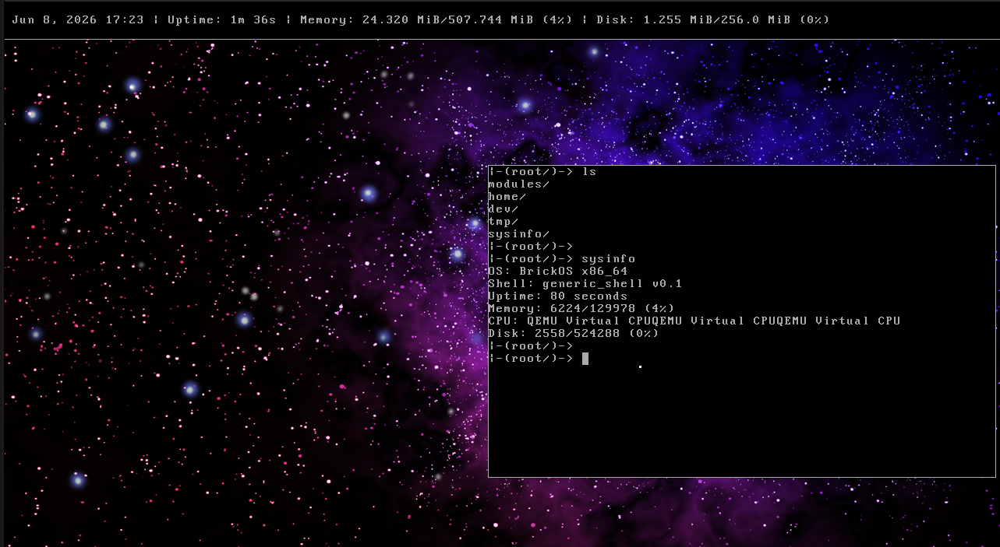

**Brick OS** is a work-in-progress 64-bit operating system using the Limine bootloader created mainly for learning purposes. 

## Dependancies
You can install the necessary dependancies by executing `deps.sh` (uses apt, if apt is not available you will need to install them yourself manually)

## Compilation && Running
You can simply run `make run` to compile and start the OS. 

## Features
- GDT, IDT, TSS
- PIT
- pmm, vmm, paged memory && higher half kernel
- 1280x720 VGA 
- userspace processes, scheduler, syscall interface...
- ACPI support through uACPI
- PCI support
- PS/2 keyboard and mouse driver, ATA disk driver, 82540em NIC driver
- custom filesytem that supports files of up to ~8MB
- devices, virtual files, IPC
- custom userspace window manager

## Notice
This project is still highly in development and kinda unstable, so things are not unlikely to break.
